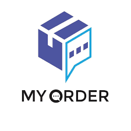
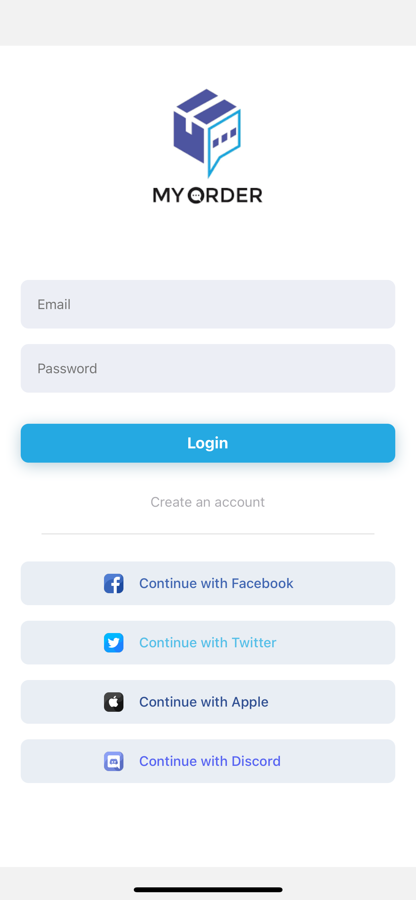

[](https://github.com/WrathChaos/react-native-login-screen)

[](https://github.com/WrathChaos/react-native-login-screen)


[](https://opensource.org/licenses/MIT)

<p align="center">
  
</p>

# 🥳 MyOrder Project

# Installation!

```js
yarn install
```

### For Android

```js
yarn android
```

### For IOS

#### For IOS # need to pod install first.
```js
cd ios && pod install
```

```js
yarn ios
```

## Author

Pakornz, pakornsudjit@gmail.com

## License

React Native Login Screen is available under the MIT license. See the LICENSE file for more info.
